# Architecture
## Technical decision

Build the compiler as a **C++23 and CMake** application. This supports a
native, cross-platform compiler core and is appropriate for a portfolio-focused
systems project. C++ does not make local-model inference or OCR substantially
faster; those stages dominate latency. The architecture therefore prioritizes
reliable integration, source provenance, and a stable local data model.

Start with a CLI. A small review UI is a later local web application served by
the compiler over loopback HTTP; do not build a general note editor or a native
desktop UI for the MVP.

## Stack

| Concern | Choice | Notes |
| --- | --- | --- |
| Language | C++23 | Use RAII, value types, `std::expected`-style errors, and no raw owning pointers. |
| Build | CMake + vcpkg manifest mode | Pin dependencies and use CMake presets for development and release. |
| CLI | CLI11 | Provides `kc import`, `kc extract`, `kc compile`, and related commands. |
| Database | SQLite + FTS5 | One project-local state file; enable foreign keys and WAL mode. |
| JSON | nlohmann/json | Parse and serialize validated data contracts. |
| PDF | Poppler adapter | Extract text and render page images. |
| OCR | Tesseract adapter | Local typed-scan baseline; handwriting support remains replaceable. |
| Local model | Ollama-compatible HTTP adapter | Initial local Gemma route; isolates model management from the compiler. |
| Optional API model | `LanguageModel` adapter | Deferred; credentials come only from environment variables or OS keychain. |
| Review UI | Local HTTP API + Svelte/TypeScript later | Used for page/text review and proposal approval, not article editing. |

## System flow

```mermaid
flowchart LR
  A["PDF, Markdown, or text notes"] --> B["Import and hash"]
  B --> C["Extraction: text, render, OCR"]
  C --> D["SQLite page records"]
  D --> E["Local LLM structured proposal"]
  E --> F["Schema and citation validation"]
  F --> G["User review and approval"]
  G --> H["Obsidian Markdown vault"]
  H --> I["SQLite FTS article search"]
```



## Project layout

```text
knowledge-compiler/
├── CMakeLists.txt
├── CMakePresets.json
├── vcpkg.json
├── apps/
│   └── kc/                         # CLI executable entry point
├── libs/
│   ├── domain/                     # Source, Page, Citation, Proposal, Article types
│   ├── storage/                    # SQLite connection, repositories, migrations, FTS
│   ├── import/                     # Hashing and source registration
│   ├── extraction/                 # PDF text, rendering, and OCR interfaces
│   ├── models/                     # Local/API model adapters and response validation
│   ├── compiler/                   # Page selection and proposal generation
│   ├── review/                     # Extraction correction and proposal review
│   ├── vault/                      # Markdown rendering and atomic writes
│   ├── search/                     # Concept/title/body search
│   └── server/                     # Deferred loopback review API
├── migrations/
├── tests/
│   ├── unit/
│   ├── integration/
│   └── fixtures/
├── docs/
├── sources/                        # Project-local immutable originals
├── vault/                          # Obsidian-compatible output
└── .knowledge-compiler/
    ├── state.sqlite
    ├── pages/                      # Rendered source-page images
    ├── backups/                    # Pre-apply article backups
    └── logs/
```

## Required interfaces

The domain layer owns all types. Infrastructure adapters implement these
interfaces and must not change Markdown or database contracts.

```cpp
class SourceImporter;
class Extractor;
class OcrProvider;
class LanguageModel;
class ProposalValidator;
class ReviewService;
class VaultWriter;
class SearchIndex;
```

`LanguageModel` receives selected, page-referenced text and returns a JSON
proposal conforming to [Data contracts](DATA_CONTRACTS.md). It never receives a
filesystem-writing capability.

## Security and ownership rules

- Use project-relative paths only in JSON and SQLite.
- Keep original imported files immutable after import. A changed file creates a
  new source version.
- Never store API keys in project files, SQLite, proposals, or logs.
- Redact authorization headers and secrets from diagnostics.
- Use temporary files plus atomic rename when applying a Markdown change.
- Back up the previous article before applying an approved proposal.
- Do not mutate Markdown outside compiler managed-section markers.

## Explicitly deferred

Semantic embeddings, automatic reconciliation across arbitrary concepts,
filesystem watch mode, a graph visualizer, cloud synchronization, broad API
support, conflict detection, and a full custom note editor are not MVP work.
